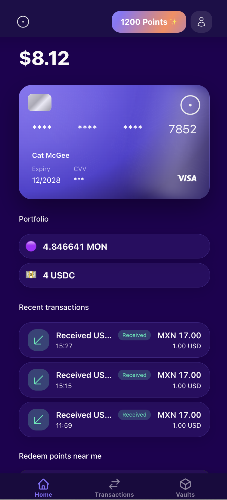
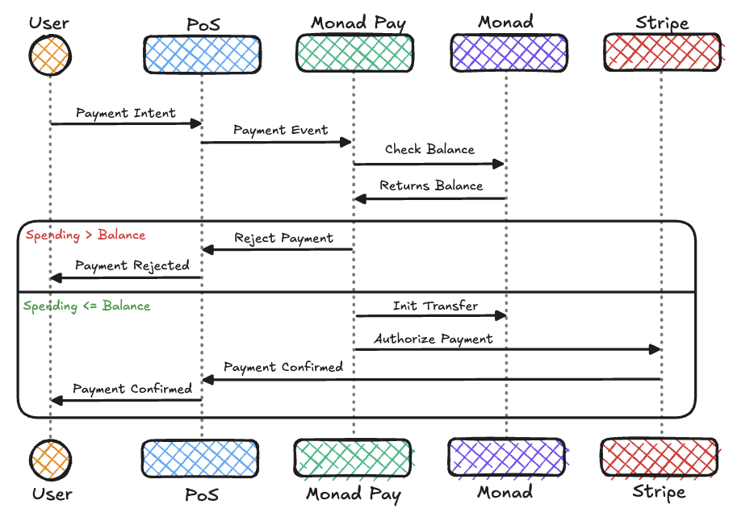

# Monad Pay

:(


With Monad Pay, users can pay with _anything_, _anywhere._ We issue a virtual card for everyone so they can spend their Monad balance. They can use it anywhere that accepts VISA!

Built by [Nacho](https://x.com/ziginiz) and [Cat](https://x.com/catmcgeecode)



## Contents

- Features
- Repo layout
- Running the app

## Features

- Use your own wallet (EOA or smart wallet) to pay for transactions instore and online that accepts VISA. The merchant gets fiat without you ever having to touch fiat
- Save by contributing to Vaults with any token in your account, which automatically stakes for you allowing you to reach your goal faster
  - Share your Vaults with other people on Monad Pay and they can contribute too! Only you can withdraw
- Earn Points onchain by using your card that can be redeemed for instore or onchain rewards

## How it works

When a user logs in, we ask them to sign a transaction that gives us access to a chosen number of tokens. When they spend using their card, we cover their transaction in fiat, routing through their card so it appears on their statement, and transfer equivalent tokens from their wallet into ours.



Sounds simple? That’s because it is! But it comes with quite a few complexities. To learn more information about exactly how we are staying secure with our funds, handling refunds, issuing cards, and more, read the [one pager]().

## Tech Stack

- **Frontend and logic:** Next.js, TypeScript, Tailwind
- **Contracts:** Solidity, Foundry
- **Database**: Supabase and drizzle
- **Card issuing**: Stripe Issuing. Currently in Sandbox, but we have an [Ltd](https://find-and-update.company-information.service.gov.uk/company/NI732549) and have approval from Stripe to go live. We will do this once Monad launches a Mainnet beta

---

## Monorepo Layout

TODO

---

## Running the app locally

There are three parts of the app to run:

- Smart contracts
  - You will needed a private key funded with MON (testnet or local)
- Database
- Frontend

### Prerequisites

- Node.js ≥ 18.x
- bun (or your favourite package manager)
- Foundry (`curl -L https://foundry.paradigm.xyz | bash` → `foundryup`)
- A wallet (private key) funded on [\*\*Monad testnet](https://testnet.monad.xyz/)\*\*

## Environment setup

Copy .env.example into an .env file.

```jsx
cp.env.example.env;
```

```jsx
NEXT_PUBLIC_MONADPAY_COMPANY_WALLET_ADDRESS = 0x0;
DATABASE_URL =
  NEXT_PUBLIC_BASE_URL =
  NEXT_PUBLIC_REOW_PROJECT_ID =
  NEXT_PUBLIC_VAULT_FACTORY_ADDRESS =
    0x4ae653259b7fbbb2c666d77cbd6279fc3534d966;
```

### Reown

We use Reown for our wallet connections. You will need to set up with Reown and get a Project ID to set as `NEXT_PUBLIC_REOW_PROJECT_ID`

### Postgres database

You will need to set up a Postgres database. We use Supabase. Put the URL into `DATABASE_URL`. Then run the migrations:

```jsx
 bun drizzle:gen && bun drizzle:push
```

### Compile contracts

TODO

---

## Run the frontend

Once you’ve got your database you’re ready to go! We already have the contracts deployed on mainnet, so you don’t need to compile and deploy contracts to run the app.

```bash
cd nextapp

# 1) Install deps
bun i

# 2) Set up environment
cp .env.example .env

# 3) Dev servers
bun dev
```
