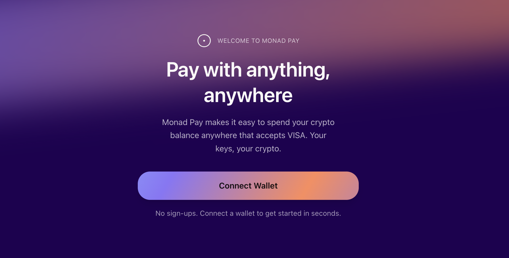
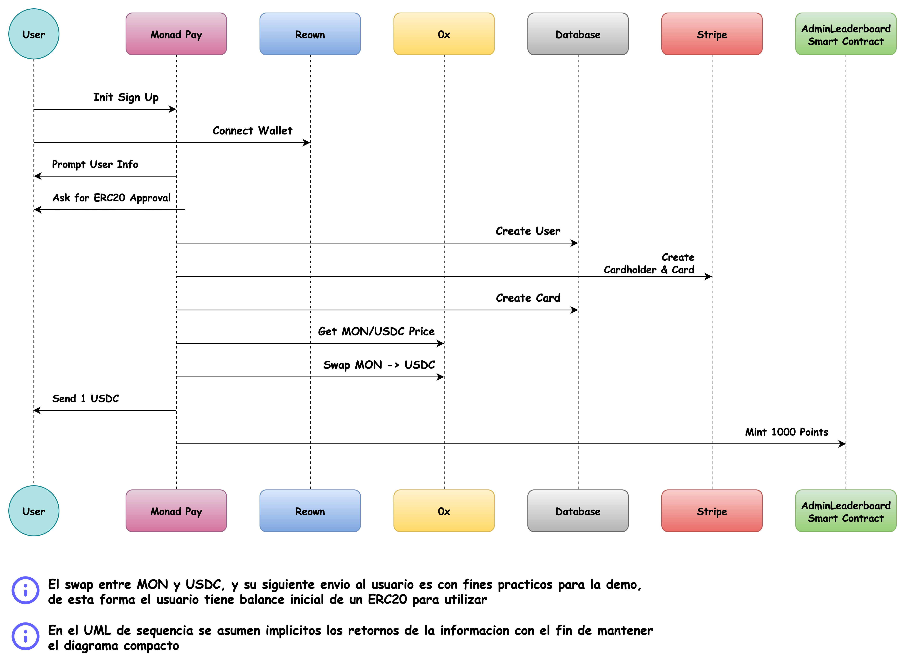
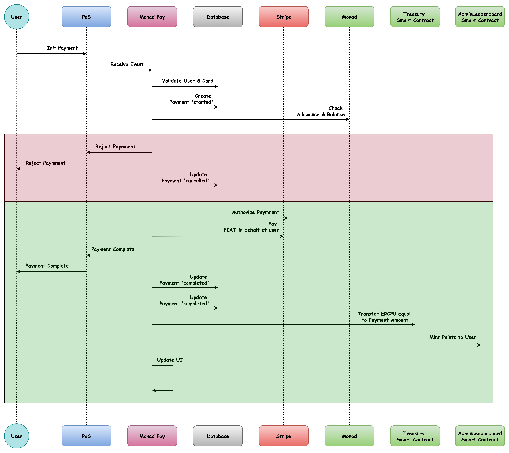
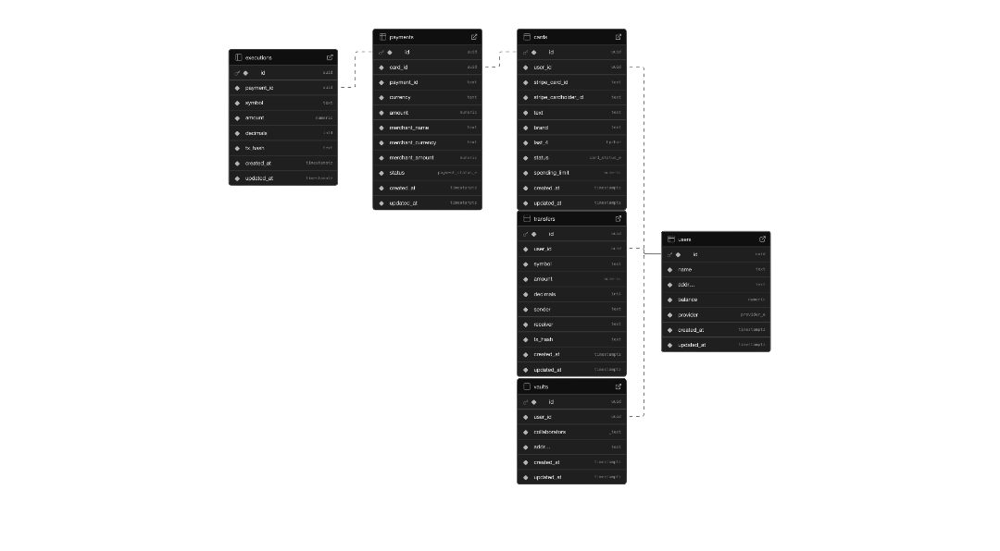

# Monad Pay

With Monad Pay, users can pay with _anything_, _anywhere._ We issue a virtual card for everyone so they can spend their Monad balance. They can use it anywhere that accepts VISA!

[Pitch deck](https://drive.google.com/file/d/1bOXyMlwSR-7c0ttm9ksKLO1NhN_pMUxq/view?usp=drive_link)

[English demo (with a new user!)](https://drive.google.com/file/d/16-v16d6SbSH6dEt-vqi-WyIjjw7Y4_UO/view?usp=drive_link)

[Spanish demo](https://drive.google.com/file/d/1PNm9qwx-6WG_WI5NKSSBkhsISGVFigPb/view?usp=drive_link)

[Go to market](https://drive.google.com/file/d/1lar2-tWtQIadZW8ZrCmjMhpGbPbRT7Ds/view?usp=drive_link)

## Test it out yourself

Monad Pay is live on [usemonadpay.com](https://www.usemonadpay.com/) so you can login and explore the features yourself. Currently we are in a sandbox environment and have not enabled real payments, as Monad is still in testnet, but you can spend your tokens using your card in our [sandbox Stripe shop](https://shop.usemonadpay.com/).

## Features

- Create a self-custodial virtual card that allows you to pay in fiat whatever is instore or online. The merchant receives FIAT while you use your crypto without having to worry about conversions or any of the crypto headache

- Create Vaults and fill them with any token in your account. These Vaults can be collaborative which means you can invite other people to contribute to it while remaining the control of the funds. Also, the funds in the Vault get staked automatically allowing you to increase your money passively. You can only withdraw when you reach your goal. Similar to an escrow contract

- Each payment that you do using _Monad Pay_ gives you on-chain points that you can redeem to use in the ecosystem (e.g. sponsored swaps in 0x) and also in real life stores (e.g. getting cashback on transactions)

## How it works

There are three important flows:

1. Sign up - issuing a fiat card for the user and doing ERC-20 approvals

2. Making a payment - we route through our treasury to cover their transaction in fiat, and use their approval to send us tokens

3. Creating and contributing to vaults - we deploy a vault contract (similar to escrow) with the user as the owner

### 1. Sign Up

We implemented _reown_ as our wallet provider, which allows us to provide an easy a friendly interface for the user to enter to our platform.

> Note: we wanted to focus on UX for this demo, so we chose an EOA flow rather than a smart wallet flow (which would require the user to fund before using as Monad does not yet have the Pectra update). This has a few fallbacks, such as the fact we can't use social logins or easily sponsor transactions. We will implement smart wallets as the primary flow once Monad enables EIP7702 - smart wallets also allow us to add a few more restrictions to make payments more secure.

After the user connects to the platform, we prompt him for his first and last name that we will use later for the card creation. The next step is to solicite approval of their selected ERC20 (USDC by default) of the user. They can select all ERC-20s that exist on Monad testnet, and USDC is required.

Once the user gives their approval, the important part comes. Using our Stripe Business account (a real one that we created with a real business called [MonadPay](https://find-and-update.company-information.service.gov.uk/company/NI732549) in UK 😄) we issue a card on his name and we store all the important information in our database.

After funding their account, we mint 1000 welcome points. The sign-up process takes around 20seconds (more if you approve more ERC-20s) and after that you will have a self-custodial virtual card that you would be able to use to buy our favourite coffee with _magic internet money_.

### 2. Payments

We have a funded Stripe Issuing account. Transactions pull through our funded account, but route through the user's card so it still appears on statements and documents related to tax compliance. The user can spend their card anywhere that accepts VISA.

Every time the user attempts to use their card, we receive an event in our backend and Stripe asks us to authorize or not. Stripe allows us 2 seconds before responding, so due to Monad's fast finality we can actually wait for the transaction to finalize on Monad before we approve the card transaction. This is the happy path, but we have also allowed the payment to go through if they meet our other requirements (user and card existence, balance + float, allowance, etc). This means the transaction will still execute when the network is congested. Even when not in the ideal happy path, it is impossible for the user to drain due to Monad's concurrency. And we will be able to implement other measures with smart wallets in future, such as 5 second days on transactions to accounts other than our contract, which is how Gnosis Pay works.

1. In the case the user don't pass the validations, we simply reject the payment and it will be reflected in the PoS that the user is using.

2. In the case that the user pass the validations, we cover their transaction in fiat using our own liquidity pool in Stripe, and after the payment was processed succesfully we execute a transaccion to collect the equivalent amount of the payment in the token that he granted approval before. Finally we record everything in the database and mint points to the user as a reward for their spending.

> We are using ENVIO for the indexing and fast-access of all the transactions performed by the user.

### Vaults

Vaults turn this app from a virtual card to a familiar e-banking experience. Users can create vaults, secured by smart contracts, for saving goals or emergency funds. We deploy the vault contract for them (through a vault factory) which means they do not have to pay the 0.25 MON to deploy. They are set as the `owner` of the vault which means only they can withdraw.

The funds are locked up until they meet their goal. Users can also copy the vault contract address and share with others who have Monad Pay (or just a Monad wallet!) and they can contribute too. This expands the functionality drastically and can be used for family savings accounts, crowdfunding, angel investments, and more. It's a beautiful marriage of blockchain and the familiarity of traditional banking.

As well as creating a smart contract, we also add the vault into our database. This allows a faster loading experience, and also means that when other users are added as contributors they can see it in their frontend without needing to be added to the smart contract (causing a transaction, therefore gas).

### Points

We have followed the succcess of Payy Wallet and realized that points have allowed them to go viral on X. (Side note - we're huge fans of Payy but they have a centralized prover, so are not fully self-custodial, and they do not have an experience that rivals banks).

Points are held in a smart contract and are similar to ERC-20s but they are non-transferrable. They can only be minted and burned by the admins of the contract. The contract also stores a leaderboard of Points which is a fun addition that any Monad app can incorporate.

Currently, a user gains points from signing up and using their card to make a payment. We have plans to incorporate points for referrals, making friends on the app, time-bound payments, recurring payments, opening and sharing vaults, and more. We see Points as a way to turn this into a mix between bank, self-custodial funds, and socialfi.

### Other UX benefits

- It is a Progressive Web App and works on all devices, and is optimized for mobile

- For the sake of this demo, we fund the user with 1 USDC and 0.1 MON so the user has an starting balance when they first open the app. This will allow them to test a small transacion with their card and cover gas when they sign approvals

- Users can swap MON to WMON directly in the app with one click to allow the card to spend their MON balance

- Vaults are deployed gaslessly

- Users can see a full list of their transactions in plain English

- Users can easily remove the ERC-20 approvals at any time from Settings

### Database Schema

## Tech Stack

- **Frontend:** Next.js, TypeScript, Tailwind
- **Backend:** Serverless Next.js APIs
- **Contracts:** Solidity and Foundry
- **Database**: Supabase and Drizzle
- **Indexing Provider**: ENVIO
- **Wallet Provider**: Reown
- **Swap Provider**: 0x
- **Card issuing**: Stripe Issuing. Currently in Sandbox, but we have an [Ltd](https://find-and-update.company-information.service.gov.uk/company/NI732549) and have approval from Stripe to go live. We will do this once Monad launches a Mainnet beta.

_Built by [Nacho](https://x.com/ziginiz) and [Cat](https://x.com/catmcgeecode) with ❤️‍🔥_
