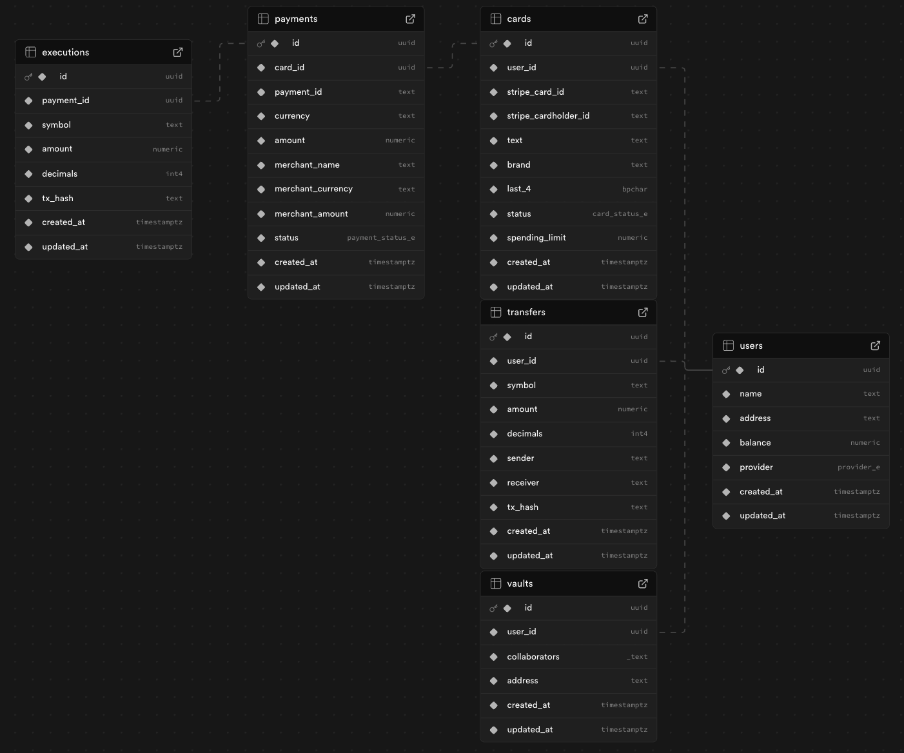

# Monad Pay

:(


With Monad Pay, users can pay with _anything_, _anywhere._ We issue a virtual card for everyone so they can spend their Monad balance. They can use it anywhere that accepts VISA!

<!-- Built by [Nacho](https://x.com/ziginiz) and [Cat](https://x.com/catmcgeecode) -->

## Contents

- Features
- How it works

## Features

- Create a self-custodial virtual card that allows you to pay in fiat whatever is instore or online. The merchant receives FIAT while you use your crypto without having to worry about conversions or any of the crypto headache.

- Create Vaults and fill them with any token in your account, these Vaults can be collaborative which means you can invite other people to contribute to it while remaining the control of the funds. Also, the funds in the Vault get staked automatically allowing you to increase your money passively.

- Each payment that you do using _Monad Pay_ gives you on-chain points that you can redeem to use in the ecosystem (e.g. sponsored swaps in 0x)

## How it works

### 1. Sign Up

We implemented _reown_ as our wallet provider, which allows us to provide an easy a friendly interface for the user to enter to our platform.

> Note: for the sake of simplicity, we are allowing only login with wallet, however, is in our roadmap to add social logins like Google and Apple.

After the user connects to the platform, we prompt him for his first and last name that we will use later for the card creation. The next step is to solicite approval of their selected ERC20 (USDC by default) to the user.

Once the user gives their approval, the important part comes. Using our Stripe Bussiness account (a real one that we created with a real business called [MonadPay](https://find-and-update.company-information.service.gov.uk/company/NI732549) in UK 😄) we issue a card on his name and we store all the important information in our database.

> We fund the user with 1 USDC for the sake of the demo, so the user has an starting balance at the moment of init the app.

After funding their account, we mint him 1000 welcome points and thats it! The sign-up process takes between 20s-40s and after that you will have a self-custodial virtual card that you would be able to use to buy our favourite coffee with _magic internet money_


### 2. Payments

After a user has created their account, he will have a issued card in Stripe for us, which he can use to spend anywhere as any other normal card.

Every time the user attempts to use their card, we are gonna receive an event in our backend and after carefully validate the information (user and card existance, balance, allowance, etc) we authorize or not the payment attempt.

1. In the case the user don't pass the validations, we just simply reject the payment and it will be reflected in the PoS that the user is using.

2. In the case that the user pass the validations, we cover their transaction in fiat using our own liquidity pool in Stripe, and after the payment was processed succesfully we execute a transaccion to collect the equivalent amount of the payment in the token that he granted approval before. Finally we record everything in the database and mint points to the user as a reward for their spending.

> We are using ENVIO for the indexing and fast-access of all the transactions performed by the user.


### Vaults

### Database Schema



## Tech Stack

- **Frontend and logic:** Next.js, TypeScript, Tailwind
- **Contracts:** Solidity, Foundry
- **Database**: Supabase and drizzle
- **Card issuing**: Stripe Issuing. Currently in Sandbox, but we have an [Ltd](https://find-and-update.company-information.service.gov.uk/company/NI732549) and have approval from Stripe to go live. We will do this once Monad launches a Mainnet beta

---

## Monorepo Layout

TODO

---

## Running the app locally

There are three parts of the app to run:

- Smart contracts
  - You will needed a private key funded with MON (testnet or local)
- Database
- Frontend

### Prerequisites

- Node.js ≥ 18.x
- bun (or your favourite package manager)
- Foundry (`curl -L https://foundry.paradigm.xyz | bash` → `foundryup`)
- A wallet (private key) funded on [\*\*Monad testnet](https://testnet.monad.xyz/)\*\*

## Environment setup

Copy .env.example into an .env file.

```jsx
cp.env.example.env;
```

```jsx
NEXT_PUBLIC_MONADPAY_COMPANY_WALLET_ADDRESS = 0x0;
DATABASE_URL =
  NEXT_PUBLIC_BASE_URL =
  NEXT_PUBLIC_REOW_PROJECT_ID =
  NEXT_PUBLIC_VAULT_FACTORY_ADDRESS =
    0x4ae653259b7fbbb2c666d77cbd6279fc3534d966;
```

### Reown

We use Reown for our wallet connections. You will need to set up with Reown and get a Project ID to set as `NEXT_PUBLIC_REOW_PROJECT_ID`

### Postgres database

You will need to set up a Postgres database. We use Supabase. Put the URL into `DATABASE_URL`. Then run the migrations:

```jsx
 bun drizzle:gen && bun drizzle:push
```

### Compile contracts

TODO

---

## Run the frontend

Once you’ve got your database you’re ready to go! We already have the contracts deployed on mainnet, so you don’t need to compile and deploy contracts to run the app.

```bash
cd nextapp

# 1) Install deps
bun i

# 2) Set up environment
cp .env.example .env

# 3) Dev servers
bun dev
```
